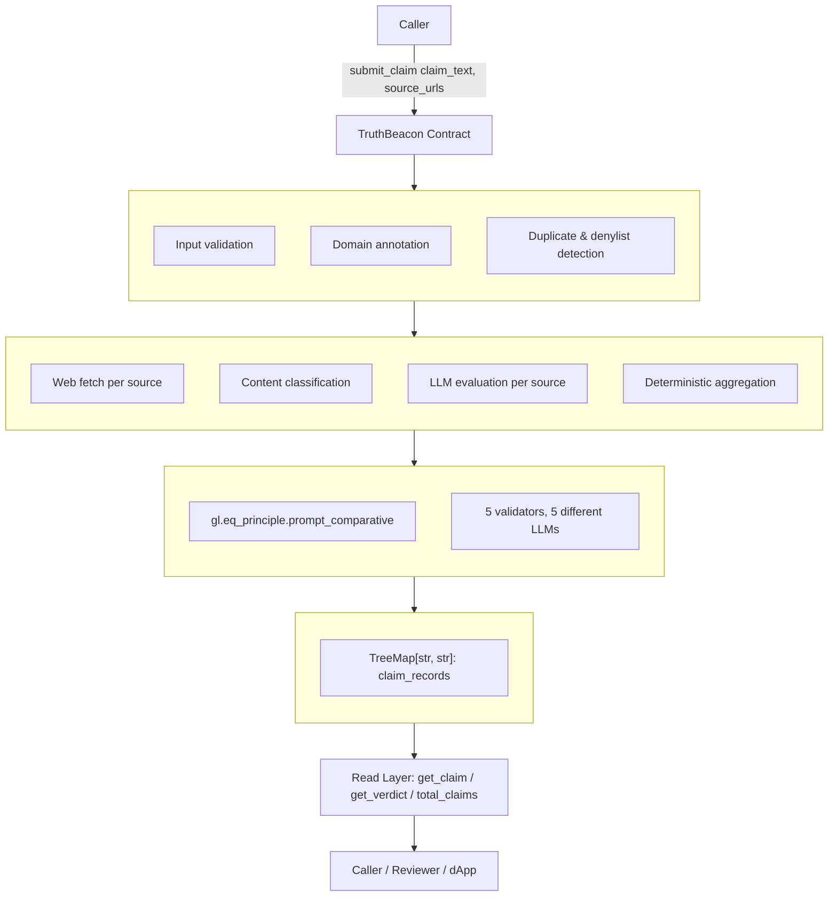
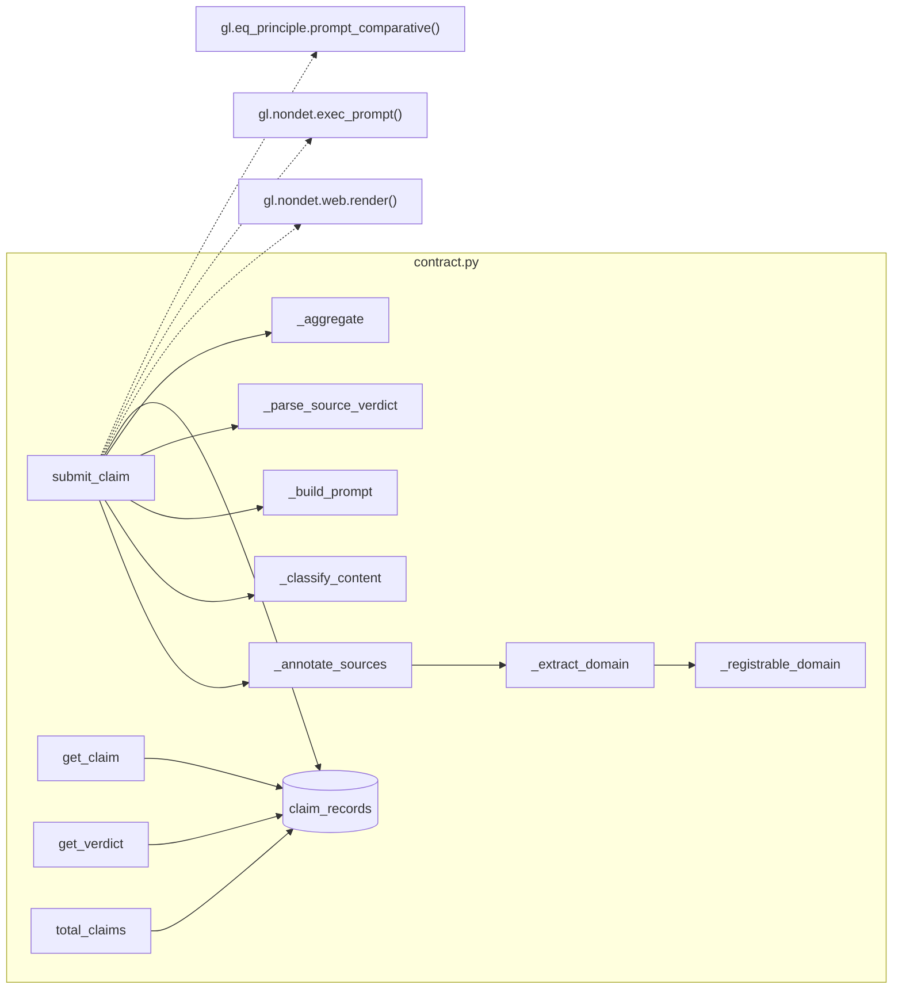
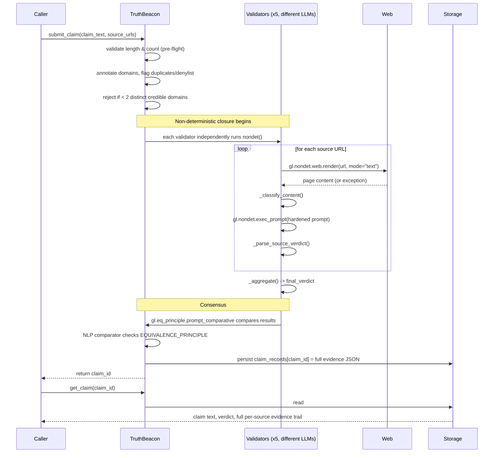
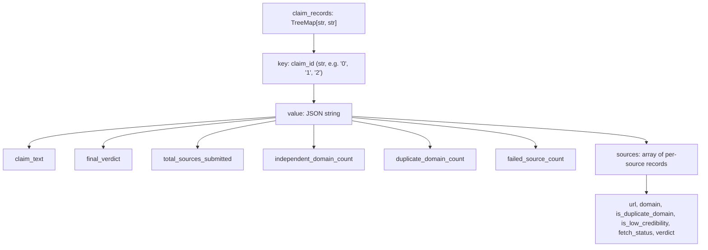

# Architecture

TruthBeacon v2 is a single GenLayer Intelligent Contract (`contract.py`) that turns a claim plus a set of candidate URLs into one consensus-backed verdict, with a full on-chain evidence trail. This document explains how it's built and why.

For *why specific choices were made* (as opposed to *how the system works*), see [DESIGN_DECISIONS.md](DESIGN_DECISIONS.md). For the adversarial/attack-surface view, see [SECURITY.md](SECURITY.md).

---

## 1. High-Level Architecture

Four layers, each with a single responsibility:

| Layer | Responsibility | Deterministic? |
|---|---|---|
| Pre-Flight | Reject invalid submissions cheaply, before spending fetch/LLM cost | Yes — pure Python |
| Evaluation | Fetch each source, classify it, ask an LLM to judge it, aggregate | No — depends on live web + LLM output |
| Consensus | Get validators to agree on the evaluation's result | Managed by GenVM via `prompt_comparative` |
| Storage / Read | Persist and expose the full evidence trail | Yes — plain reads/writes |

---

## 2. Component Diagram

Every function above is a `@classmethod` or `@staticmethod` with a single, narrow purpose — this is what makes the 87-test offline suite possible: each one is independently testable without a live GenLayer node.

---

## 3. End-to-End Execution Flow

This flow was verified live on GenLayer Studio, not just in offline tests — see [REVIEWER_GUIDE.md](REVIEWER_GUIDE.md) for the transaction hashes and what each one proves.

---

## 4. Why `prompt_comparative`, Not `strict_eq`

`gl.eq_principle.strict_eq()` requires every validator to return a byte-identical result. That is safe for pure computation, but GenLayer's own documentation is explicit that it must never be used for LLM-derived output, because independent LLM calls are not guaranteed to produce identical text even when every validator reaches the same substantive conclusion.

TruthBeacon's `nondet()` closure does two non-deterministic things per source — fetch a live web page, and ask an LLM to judge it — so its output is LLM-derived by construction. `gl.eq_principle.prompt_comparative(nondet, principle=EQUIVALENCE_PRINCIPLE)` is used instead: each validator runs the same closure independently, and an NLP comparator judges whether results are *equivalent* under a precise, field-by-field principle, rather than requiring identical bytes.

This is not a cosmetic choice — an earlier draft of this contract used `strict_eq` here, and it was found and fixed during a critical self-review (see [CHANGELOG.md](CHANGELOG.md)). It is now confirmed correct against GenLayer's current SDK.

---

## 5. Why Multiple Sources

The contract this project replaces checked exactly one caller-selected page. A single page can be fabricated, mirrored, or simply wrong, and the contract had no way to know. `submit_claim` now requires 3–6 candidate URLs (`MIN_SOURCES_SUBMITTED = 3`, `MAX_SOURCES_SUBMITTED = 6`), and a verdict of `Verified`/`Refuted` requires at least `MIN_INDEPENDENT_DOMAINS = 2` of them to independently agree. A single confident source, however convincing, can never produce a confident verdict on its own.

---

## 6. Why Duplicate-Domain Detection

Requiring "multiple sources" is meaningless if a caller can submit three URLs that are really the same publisher (or three subdomains of the same site). `_registrable_domain` reduces every URL to an approximate registrable domain (`news.example.com`, `www.example.com`, and `mirror.example.com` all become `example.com`), and `_annotate_sources` marks the second and later occurrence of any domain as `is_duplicate_domain = True`. `_aggregate` excludes duplicates from the corroboration count entirely — this was verified live on Studio (see the Eiffel Tower test in [REVIEWER_GUIDE.md](REVIEWER_GUIDE.md), where two Wikipedia URLs both said "Supported" but only counted once).

---

## 7. Why Provenance Matters

The original rejection specifically cited a lack of auditable evidence — nobody could see *why* the contract reached a verdict. Every source, whether it succeeded or failed, is recorded with: the exact URL, its registrable domain, whether it was a duplicate, whether it was on the low-credibility denylist, its fetch status, and its individual verdict. This is persisted in full via `get_claim()`, so any observer can audit the entire basis for a decision after the fact — not just the final word.

---

## 8. Storage Model

One `TreeMap[str, str]` field stores everything, keyed by sequential claim ID. The value is a single sorted-key JSON blob per claim. This is a deliberate simplification: GenLayer's storage types don't natively support nested lists of dicts, so the alternative would be several parallel TreeMaps (one per field) that could drift out of sync. A single JSON blob keeps read and write both atomic and simple to audit. See [DESIGN_DECISIONS.md](DESIGN_DECISIONS.md) for the full trade-off discussion.

---

## 9. Consensus Model

GenLayer's Optimistic Democracy: multiple validators, each potentially running a different LLM, independently execute the non-deterministic closure and must reach agreement (via `prompt_comparative`'s NLP comparator) before a transaction finalizes. TruthBeacon was deployed and tested with 5 validators running 5 different LLM backends (GPT-5, Claude Sonnet, Gemini, Mistral, Qwen, Kimi, GPT-OSS across different transactions) — every live transaction reached unanimous agreement, including on rejections (see [REVIEWER_GUIDE.md](REVIEWER_GUIDE.md)).

---

## 10. Security Model (Summary)

Full detail in [SECURITY.md](SECURITY.md). In brief: prompt injection is mitigated by explicit guardrails covering both the claim text and fetched content; fake-news sources are excluded from corroboration via a denylist; Sybil-style domain stuffing is defeated by duplicate-domain detection; fetch failures are classified rather than silently mistreated as evidence; and every value that crosses the consensus boundary is restricted to a small fixed vocabulary.

---

## 11. Design Trade-offs (Summary)

Full detail in [DESIGN_DECISIONS.md](DESIGN_DECISIONS.md). In brief: this contract intentionally does not implement a full Public Suffix List, cross-domain content-similarity detection, cryptographic provenance, or a spam/staking mechanism. Each of these is a deliberate scope boundary for an educational reference implementation, not an oversight — see [ROADMAP.md](ROADMAP.md) for what a production evolution would add.
