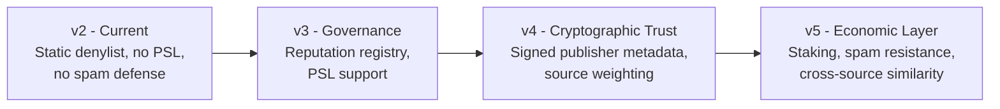

# Roadmap

TruthBeacon v2 is an educational reference implementation. This document lists realistic future directions and explains, for each one, why it wasn't implemented now rather than leaving that unstated.

---

## Governance-Managed Reputation Registry

**What it would replace:** `LOW_CREDIBILITY_DOMAINS`, currently a small, hardcoded `frozenset` in `contract.py`.

**Why not now:** GenVM contracts must be deterministic — every validator must see the same data. A live, externally-updated reputation feed cannot be safely queried from consensus-critical code without validators potentially observing different snapshots at different times. A hardcoded list sidesteps this at the cost of requiring a contract upgrade to add new entries.

**How it could work:** A separate governance contract (or a GenLayer-native voting mechanism) that maintains an on-chain, versioned registry. TruthBeacon would read from a *specific, agreed-upon block/version* of that registry rather than an arbitrary live query — preserving determinism while allowing updates without redeploying `contract.py` itself.

---

## Public Suffix List (PSL) Support

**What it would replace:** `_registrable_domain`'s lightweight last-two-labels approximation with a small hardcoded multi-part-suffix list.

**Why not now:** A real PSL has thousands of entries and changes over time. Bundling it requires either network access from deterministic code (breaks determinism) or freezing a snapshot indefinitely with no update path — worse than the current small, auditable, hand-maintained list for a reference implementation.

**How it could work:** Similar to the reputation registry — an on-chain, versioned PSL snapshot that the contract reads deterministically, updated via governance rather than ad-hoc network calls. Alternatively, if GenVM ever ships a native, deterministic PSL primitive, this becomes a straightforward swap of `_registrable_domain`'s internals with no change to its public contract (still returns a domain string).

---

## Cryptographic Provenance / Signed Publisher Metadata

**What it would add:** Cryptographic proof that fetched content genuinely came from the claimed publisher and hasn't been tampered with in transit or by a malicious relay.

**Why not now:** This requires infrastructure that doesn't broadly exist on the open web today — most news publishers don't sign their HTML responses. `gl.nondet.web.render` fetches content as any browser would; there's no signature to verify. This is a gap in the *web's* infrastructure, not something TruthBeacon can fix unilaterally.

**How it could work:** If publishers adopt content-signing standards (analogous to DKIM for email), or if GenVM adds native support for verifying HTTPS certificate chains as part of fetch provenance, this could be layered on top of the existing `fetch_status` classification without changing the aggregation logic.

---

## Reputation Scoring / Evidence Weighting

**What it would replace:** The current binary trust model (every non-denylisted, non-duplicate source counts equally).

**Why not now:** Introducing a continuous or tiered trust score raises real determinism and consensus questions — a comparator judging "is this a 0.7-confidence result equivalent to a 0.75-confidence result?" is a much harder equivalence principle to write precisely than the current categorical `Supported`/`NotSupported`/`Unclear` scheme. This was a deliberate simplicity trade-off for v2.

**How it could work:** A weighted aggregation where, say, a `.gov` domain counts more heavily than a personal blog, using a governance-managed weight table (same infrastructure as the reputation registry above). The categorical vocabulary could stay the same; only `_aggregate`'s vote-counting logic would need to become weighted rather than uniform.

---

## Source Weighting by Recency / Primary-vs-Secondary

**What it would add:** Distinguishing a primary source (e.g., an official statement) from secondary reporting (a news article about the statement), and weighting accordingly.

**Why not now:** This requires the LLM to make a *second* categorical judgment per source (not just "does this support the claim" but "is this primary or secondary"), which multiplies the consensus surface area and the number of things that must match for `prompt_comparative` to converge. The current `_build_prompt` guardrail about syndicated/wire-copy content is a lighter-weight partial mitigation in this direction.

**How it could work:** Add a second fixed-vocabulary field (`source_type: "primary" | "secondary"`) to the per-source record, extend `EQUIVALENCE_PRINCIPLE` to cover it, and adjust `_aggregate`'s weighting accordingly.

---

## Spam Resistance / Staking

**What it would add:** A cost mechanism (fee or staked deposit) making it expensive to spam the contract with garbage claims and grow `claim_records` unboundedly.

**Why not now:** This is a genuine architectural addition — payable methods, a slashing/refund mechanism, and probably a minimum-stake parameter — not a small patch to the existing design. It was explicitly out of scope for this review cycle, which focused on corroboration correctness rather than economic design.

**How it could work:** Make `submit_claim` a payable method requiring a small deposit, refunded (or not, if found to be spam by some governance process) after resolution. This is a well-understood pattern in other GenLayer/blockchain contracts and doesn't require new research — just deliberate design time.

---

## Cross-Source Content-Similarity Detection

**What it would add:** Detecting when two *different* registrable domains are republishing the same underlying wire-service text word-for-word (currently, only same-domain duplication is caught).

**Why not now:** A deterministic, consensus-safe way to do this needs either (a) a canonical text-similarity function every validator computes identically — risky, since independent fetches of the "same" page can differ slightly (ads, timestamps, minor formatting) even when the underlying story is identical, or (b) exposing raw fetched content on-chain for comparison, which conflicts with the fixed-vocabulary design that makes `prompt_comparative` reliable in the first place (see [DESIGN_DECISIONS.md § 5](DESIGN_DECISIONS.md#5-why-fixed-vocabularies)).

**How it could work:** A content-hash-based approach where each validator computes a fuzzy hash (e.g., simhash) of the fetched text and only the *hash* — not the raw content — crosses the consensus boundary, with `EQUIVALENCE_PRINCIPLE` extended to tolerate small hash differences. This needs real experimentation to confirm it doesn't reintroduce the exact convergence problems `prompt_comparative` was adopted to avoid.

---

## Summary Table

| Improvement | Blocked by | Complexity to add |
|---|---|---|
| Governance reputation registry | Determinism (can't query live external data) | Medium — needs a companion governance contract |
| PSL support | Same determinism constraint, larger dataset | Medium — same infrastructure as above |
| Cryptographic provenance | Missing web-wide infrastructure, not a contract limitation | High — depends on external ecosystem adoption |
| Reputation scoring / weighting | Consensus complexity (harder equivalence principle) | Medium — extends existing aggregation |
| Source weighting (primary/secondary) | Consensus complexity (second categorical judgment per source) | Medium — extends prompt + schema |
| Spam resistance / staking | Out of scope for this review cycle | Medium — well-understood pattern, needs design time |
| Cross-source content similarity | Consensus safety (raw content vs. fixed vocabulary) | High — needs new research on fuzzy-hash equivalence |
