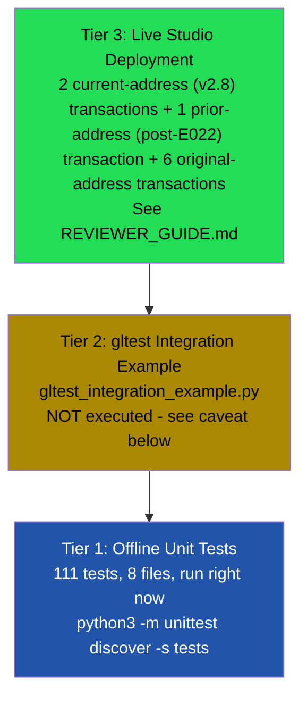

# Testing

TruthBeacon v2 has three tiers of testing: offline unit tests (111, all passing, run in this repository), an unexecuted live-integration example (`gltest_integration_example.py`), and real deployment evidence on GenLayer Studio. This document explains what each tier proves and what it does not.

---

## 1. Testing Pyramid



Higher tiers give stronger real-world confidence but cost more to run. Tier 1 is what's actually verified in this repository's CI-equivalent (manual `unittest` run); Tier 3 is what was actually run against a live network.

---

## 2. Tier 1 — Offline Unit Tests

**Run them:**
```bash
python3 -m unittest discover -s tests -p "test_*.py" -v
```

**Result: 111/111 passing.** These run against a small local stub of the `genlayer` SDK (`tests/genlayer_stub/`) — no GenLayer node, network access, or real LLM required. `gl.nondet.web.render` and `gl.nondet.exec_prompt` are monkeypatched per test to simulate specific scenarios deterministically.

### 2a. Unit tests (pure functions, no mocking needed)

| File | Tests | Function under test | What it proves |
|---|---|---|---|
| `test_domain_extraction.py` | 26 | `_extract_domain`, `_registrable_domain`, `_normalize_domain_declaration` (v2.8) | The four required subdomain-independence cases; multi-part suffix handling; IPv6/trailing-dot edge cases; `expected_domains` entry normalization (bare domain and full-URL forms) |
| `test_content_classification.py` | 11 | `_classify_content` | All five malformed-content checks, plus explicit false-positive guards |
| `test_aggregation.py` | 15 | `_aggregate` | Every branch of the final-verdict decision rule, including majority-with-dissent; plus (v2.8) staleness exclusion, source-authority exclusion, and backward-compatible missing-key defaults |
| `test_parser.py` | 8 | `_parse_source_verdict` | Exact/case-insensitive matching, multi-line responses, substring false-positive guard |
| `test_prompt_and_consensus.py` | 12 | `_build_prompt`, `EQUIVALENCE_PRINCIPLE` | Every guardrail phrase is actually present in the model prompt, including (v2.8) the freshness guardrail; the equivalence principle references real schema fields, including the two new v2.8 stat fields |

These 72 tests require zero mocking — they call deterministic functions directly with crafted inputs and assert exact outputs.

### 2b. Integration-style tests (within the offline stub)

| File | Tests | What it proves |
|---|---|---|
| `test_input_validation.py` | 9 | `submit_claim`'s pre-fetch validation rejects invalid input via `gl.vm.UserError`, before any fetch/LLM cost |
| `test_end_to_end.py` | 22 | The full `submit_claim` → `get_claim` pipeline, with `gl.nondet.*` mocked: successful verification, refutation, disputes, duplicates, failures, adversarial sources; plus (v2.8) `expected_domains` policy enforcement and freshness/staleness gating, exercised end-to-end |
| `test_storage.py` | 8 | `get_claim`/`get_verdict`/`total_claims`, and that multiple claims remain independently retrievable without cross-contamination |

**Total: 111 tests across 8 files** (up from 87 pre-v2.8, with zero reduction in prior coverage — every previously-passing scenario still passes). See `tests/README.md` for the full coverage checklist mapping every requested scenario (valid claims, insufficient sources, duplicate domains, malformed URLs, timeouts, empty/malformed content, low-credibility domains, source-authority policy, freshness/staleness, boundary values, storage persistence) to its test file.

### 2c. What Tier 1 does NOT prove

- That `gl.nondet.web.render`, `gl.nondet.exec_prompt`, and `gl.eq_principle.prompt_comparative` are called with a signature the *real* GenVM accepts — the stub only checks that contract.py calls functions with those names and argument shapes; it does not validate against a live SDK. (This was separately verified via SDK compatibility research and confirmed by the successful live deployment in Tier 3.)
- That real multi-validator consensus actually converges — the stub calls the closure once and returns its result directly, simulating neither multiple validators nor the NLP comparator.
- That real web pages behave as the mocked fixtures assume.
- That a real LLM, given the v2.8 two-line prompt format, reliably produces a parseable freshness judgment on genuinely ambiguous content — the offline tests exercise the *parsing and gating logic* deterministically, but the actual judgment quality on live content is confirmed only by Tier 3.

---

## 3. Tier 2 — `gltest` Integration Example

**File:** `tests/gltest_integration_example.py`
**Status: NOT executed.** No GenLayer Studio/node was available in the environment where this repository was developed, and this file requires `pytest` plus the `gltest` package.

It is deliberately named without a `test_` prefix so it is excluded from the default `unittest discover -p "test_*.py"` pattern — running the documented Tier 1 command will never fail because of this file.

It sketches the same core scenarios (successful verification, conflicting evidence, duplicate domains, failed fetches, malicious sources, and an all-denylisted rejection) using GenLayer's own `gltest` mocking framework (`MockedWebResponse` / `MockedLLMResponse`), based on published `gltest` documentation. The exact API surface used (`get_contract_factory`, `factory.deploy`, the `mock_web_responses=`/`mock_llm_responses=` signature) has **not** been confirmed against an installed `gltest` version, and it has **not** been updated for the v2.8 `expected_domains`/freshness additions. Treat it as a starting point to adapt and validate, not a verified passing suite.

Run it once you have a GenLayer Studio/node:
```bash
pip install genlayer-test --break-system-packages
gltest test tests/gltest_integration_example.py
```

---

## 4. Tier 3 — Live Deployment Evidence

This is the tier that closes the gap Tier 1 and Tier 2 cannot: real network fetches, real LLM calls from multiple providers, and real multi-validator consensus, all observed directly.

**Current contract address (v2.8):** `0x93F0F657a008FC99a41149E444AA37a604A14580` (redeployed for the source-authority policy + freshness signal — see [CHANGELOG.md § v2.8](CHANGELOG.md#v28--source-authority-policy--freshness-signal-current))
**Public address page:** `https://explorer-studio.genlayer.com/address/0x93F0F657a008FC99a41149E444AA37a604A14580`

| # | Scenario | Result | Consensus |
|---|---|---|---|
| 1 | `expected_domains` source-authority policy (Eiffel Tower, 3 sources, 1 unauthorized, 1 inaccessible) | `InsufficientEvidence`, `unauthorized_domain_count: 1` | FINALIZED, no errors |
| 2 | Freshness/staleness gating (JWST launch, 3 sources incl. a 2018 archived snapshot, 1 inaccessible) | `InsufficientEvidence`, `stale_source_count: 1` | FINALIZED, no errors (comparator `Disagree` marks on individual validators are expected `prompt_comparative` behavior, not errors) |

**Prior contract address (post-E022, historical, superseded):** `0xE30A0F67Da4a3F58F2E31C82dfbc50e8B8F588A5`
**Public address page:** `https://explorer-studio.genlayer.com/address/0xE30A0F67Da4a3F58F2E31C82dfbc50e8B8F588A5`

| # | Scenario | Result | Consensus |
|---|---|---|---|
| 1 | Eiffel Tower claim (3 sources, 1 inaccessible) | `Verified` | Reached consensus, FINALIZED, no errors |

**Original prior contract address (historical, superseded):** `0xF7275bA620A2a405905f8d93356012166753a62A`
**Public address page:** `https://explorer-studio.genlayer.com/address/0xF7275bA620A2a405905f8d93356012166753a62A`

| # | Scenario | Transaction | Result | Consensus |
|---|---|---|---|---|
| 1 | Deploy | `0x89f90b71...ccfddf1` | SUCCESS | 5/5 Agree |
| 2 | Clean successful verification | `0xfd19c79a...b29b2940` | `Verified` | 5/5 Agree |
| 3 | Partial fetch failure | `0xb784c266...dbd40f34` | `Unverified` | 5/5 Agree |
| 4 | Duplicate-domain detection | `0x6b3bdd44...eac7b274` | `InsufficientEvidence` | 5/5 Agree |
| 5 | Invalid input rejection | `0xe9338d2c...a028e7595` | ERROR (rejected) | 5/5 Agree, identical error text |
| 6 | Second fetch-failure instance | `0x1ce1f1b9...ceb57c93` | `InsufficientEvidence` | 5/5 Agree |

Full transaction inputs/outputs and what each proves: see [REVIEWER_GUIDE.md](REVIEWER_GUIDE.md).

**What Tier 3 proves that Tiers 1–2 cannot:**
- The contract actually deploys and executes on real GenVM infrastructure.
- `gl.eq_principle.prompt_comparative` genuinely reaches consensus across validators running different LLMs (GPT-5, Claude Sonnet, Gemini, Mistral, Qwen, Kimi, GPT-OSS observed across different transactions).
- Real-world fetch failures occur and are handled gracefully exactly as the offline tests predict (britannica.com and nasa.gov each returned `inaccessible` in separate live transactions).
- The conservative aggregation behavior is not just a unit-test artifact — a real, undisputed historical fact (Neil Armstrong) still resolved to `Unverified` live, because evidence was genuinely incomplete.
- The v2.8 `expected_domains` and freshness gates genuinely exclude sources on live infrastructure, not just in mocked tests — both v2.8 transactions resolve to `InsufficientEvidence` precisely because the newly-excluded source was the one keeping the count above threshold.
- Validator disagreement handling: "Validator execution cancelled after quorum" appeared in every multi-validator transaction — this is GenVM's own optimization once enough validators agree, not a fault. Similarly, individual validators marked `Disagree` in the v2.8 freshness transaction — expected `prompt_comparative` behavior (equivalence, not exact-match, is what's being judged), not a fault.

---

## 5. Coverage Summary

| Requested coverage area | Covered by |
|---|---|
| Valid claims | Tier 1 (`test_end_to_end.py`), Tier 3 (original-address tx #2) |
| Insufficient sources | Tier 1 (`test_input_validation.py`), Tier 3 (original-address tx #5) |
| Duplicate domains | Tier 1 (`test_domain_extraction.py`, `test_end_to_end.py`), Tier 3 (original-address tx #4) |
| Malformed URLs | Tier 1 (`test_domain_extraction.py`) |
| Inaccessible URLs | Tier 1 (`test_end_to_end.py`), Tier 3 (original-address tx #3, #6; both v2.8 transactions) |
| Timeout handling | Tier 1 (`test_end_to_end.py`) |
| Empty content | Tier 1 (`test_content_classification.py`) |
| Malformed content | Tier 1 (`test_content_classification.py`, `test_end_to_end.py`) |
| Low-credibility domains | Tier 1 (`test_aggregation.py`, `test_end_to_end.py`) |
| **Source-authority policy (`expected_domains`), v2.8** | Tier 1 (`test_domain_extraction.py`, `test_aggregation.py`, `test_end_to_end.py`), Tier 3 (v2.8 tx #1) |
| **Freshness/staleness signal, v2.8** | Tier 1 (`test_prompt_and_consensus.py`, `test_aggregation.py`, `test_end_to_end.py`), Tier 3 (v2.8 tx #2) |
| Aggregation logic | Tier 1 (`test_aggregation.py`) |
| Parser behavior | Tier 1 (`test_parser.py`) |
| Registrable-domain extraction | Tier 1 (`test_domain_extraction.py`) |
| Boundary values | Tier 1 (length limits, threshold edges across multiple files) |
| Storage persistence | Tier 1 (`test_storage.py`) |
| Real network + LLM behavior | Tier 3 only |
| Real multi-validator consensus | Tier 3 only |

Every row has at least one concrete, checkable piece of evidence — no coverage claim in this document is asserted without a specific test name or transaction hash behind it.
